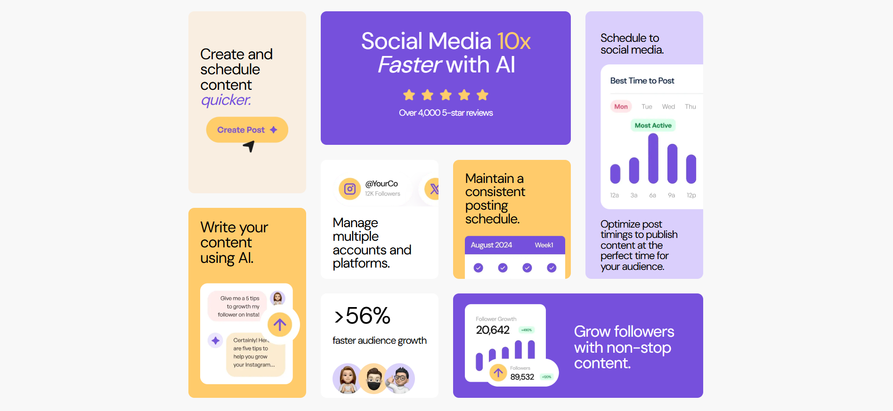
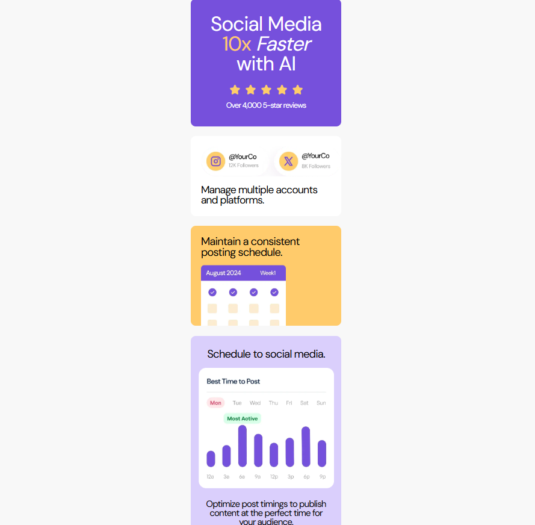
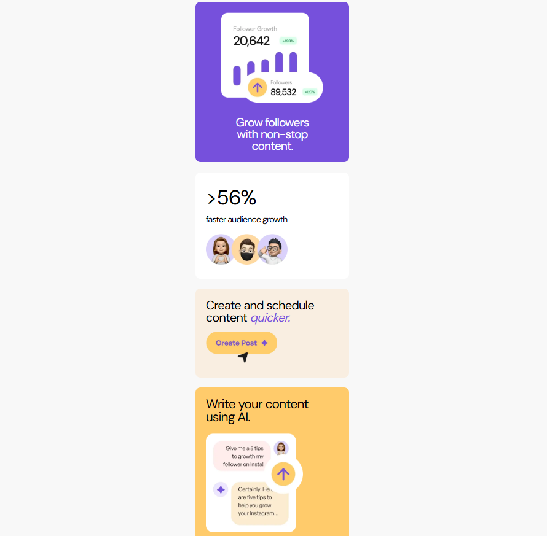

# Frontend Mentor - Bento grid solution

This is a solution to the [Bento grid challenge on Frontend Mentor](https://www.frontendmentor.io/challenges/bento-grid-RMydElrlOj).

## Table of contents

- [Overview](#overview)
  - [The challenge](#the-challenge)
  - [Screenshot](#screenshot)
  - [Links](#links)
- [My process](#my-process)
  - [Built with](#built-with)
  - [What I learned](#what-i-learned)
  - [Useful resources](#useful-resources)
- [Author](#author)

## Overview

### The challenge

Users should be able to:

- View the optimal layout for the interface depending on their device's screen size

### Screenshot

### Links

- Solution URL: [Add solution URL here](https://your-solution-url.com)
- Live Site URL: [Add live site URL here](https://your-live-site-url.com)

## My process

### Built with

- Semantic HTML5 markup
- CSS custom properties
- Flexbox
- CSS Grid
- Mobile-first workflow

### What I learned

Learned how to use CSS Grid. And the most important thing, I used mobile first workflow for the first time. Thanks to this, I made two designs - mobile and desktop - much easier.

### Useful resources

- [Learn CSS Grid in 20 Minutes](https://www.youtube.com/watch?v=0-DY8J_skZ0) - This video helped me understand how CSS Grid Works. This guy explains the topic very clearly and shows good examples of using different properties.

## Author

- Website - [Leya](https://github.com/minLeya)
- Frontend Mentor - [@minLeya](https://www.frontendmentor.io/profile/minLeya)

